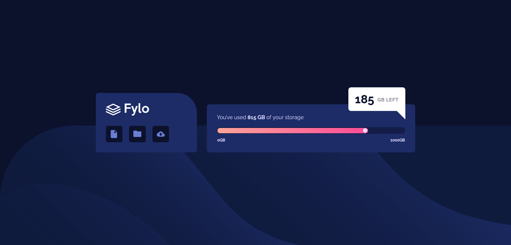

# Frontend Mentor - Fylo data storage component solution

This is a solution to the [Fylo data storage component challenge on Frontend Mentor](https://www.frontendmentor.io/challenges/fylo-data-storage-component-1dZPRbV5n). Frontend Mentor challenges help you improve your coding skills by building realistic projects. 

## Table of contents

- [Overview](#overview)
  - [The challenge](#the-challenge)
  - [Screenshot](#screenshot)
  - [Links](#links)
- [My process](#my-process)
  - [Built with](#built-with)
- [Author](#author)

## Overview

Data storage component using HTML and CSS

### The challenge

Users should be able to:

- View the optimal layout for the site depending on their device's screen size

### Screenshot

### Links

- Solution URL: [here](https://github.com/pilatech/fylo-data-storage-component)
- Live Site URL: [here](https://fylo-data-storage-component-by-pilate.netlify.app/)

## My process

- First created markup (In a 'Desktop-first' aproach)
- Then created markup using the Mobile-first aproach

### Built with

- Semantic HTML5 markup
- CSS custom properties
- Flexbox
- CSS Grid
- Mobile-first workflow

## Author

- Frontend Mentor - [@pilatech](https://www.frontendmentor.io/profile/pilatech)
- Twitter - [@pchinyengetere](https://www.twitter.com/pchinyengetere)
